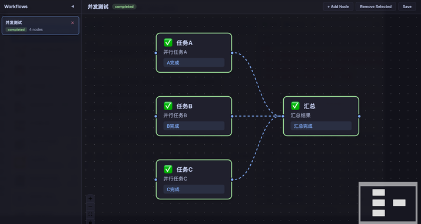

# Claude Code Workflow Orchestrator



A Vue Flow-based workflow visualization system for Claude Code. When Claude Code starts a task, it automatically creates a visual workflow, waits for user confirmation, then shows real-time progress as each step executes.

## Quick Start

```bash
# 1. Install dependencies
cd backend && pip3 install -r requirements.txt && cd ..
cd frontend && npm install && cd ..

# 2. Start services
./start.sh

# 3. Open browser
open http://localhost:5173
```

Done. Claude Code will automatically use the workflow skill when you give it a multi-step task.

---

## Prerequisites

| Dependency | Version | Check command |
|------------|---------|---------------|
| Python | 3.9+ | `python3 --version` |
| Node.js | 18+ | `node --version` |
| npm | 8+ | `npm --version` |
| Claude Code | latest | `claude --version` |

## Installation

### Step 1: Get the project

```bash
cd /path/to/cc_work
```

### Step 2: Install backend (Python/FastAPI)

```bash
cd backend
pip3 install -r requirements.txt
cd ..
```

This installs: FastAPI, uvicorn, sse-starlette, pydantic.

### Step 3: Install frontend (Vue 3/Vite)

```bash
cd frontend
npm install
cd ..
```

This installs: Vue 3, Vue Flow, Vite, and related packages.

### Step 4: Verify installation

```bash
# Check backend dependencies
python3 -c "import fastapi, uvicorn, sse_starlette; print('Backend OK')"

# Check frontend dependencies
ls frontend/node_modules/@vue-flow/core/package.json && echo "Frontend OK"
```

## Running the Services

### Option A: One-command start (recommended)

```bash
./start.sh
```

This script:
1. Kills any existing processes on ports 9800 and 5173
2. Starts the FastAPI backend on port 9800
3. Starts the Vite frontend on port 5173
4. Shows logs from both services

Press `Ctrl+C` to stop both services.

### Option B: Manual start (two terminals)

**Terminal 1 — Backend:**
```bash
cd backend
python3 app.py
```
Output: `Uvicorn running on http://0.0.0.0:9800`

**Terminal 2 — Frontend:**
```bash
cd frontend
npx vite --host
```
Output: `Local: http://localhost:5173/`

### Verify services are running

```bash
# Backend health check
curl http://localhost:9800/api/health
# Expected: {"status":"ok","workflows":0}

# Frontend — open in browser
open http://localhost:5173
```

## Installing the Skill

The skill is already included at `.claude/skills/workflow.md`. Claude Code automatically discovers skills in `.claude/skills/` — no manual installation needed.

To verify:
```bash
cat .claude/skills/workflow.md | head -5
```

The skill activates automatically when Claude Code starts in this project directory.

## Using the Skill

### How it works

1. You give Claude Code a multi-step task
2. Claude Code creates a workflow graph and posts it to the API
3. The workflow appears on http://localhost:5173 for your review
4. You can modify nodes/edges, then click **"Confirm Workflow"**
5. Claude Code detects the confirmation and starts executing
6. Each node updates in real-time as work progresses

### Example

```
You: Create a REST API with user authentication and tests

Claude Code automatically:
  → Creates workflow with 4 steps
  → Shows it on the UI
  → Waits for you to confirm
  → Executes each step with live status updates
```

### Node status indicators

| Status | Icon | Visual |
|--------|------|--------|
| `pending` | ⏳ | Gray border |
| `in_progress` | ⚡ | Blue border + pulsing glow |
| `completed` | ✅ | Green border |
| `failed` | ❌ | Red border |

## Troubleshooting

### Port already in use
```bash
# Kill processes on ports 9800 and 5173
lsof -ti:9800 | xargs kill -9
lsof -ti:5173 | xargs kill -9
```

### Backend won't start
```bash
# Check Python dependencies
pip3 install -r backend/requirements.txt

# Check for errors
cd backend && python3 app.py
```

### Frontend won't start
```bash
# Reinstall dependencies
cd frontend && rm -rf node_modules && npm install
```

### SSE not showing real-time updates
- Open browser console (F12) and look for `[SSE]` logs
- Ensure backend is running: `curl http://localhost:9800/api/health`
- The workflow must be selected in the sidebar to receive SSE events

## Project Structure

```
cc_work/
├── backend/
│   ├── app.py              # FastAPI server (REST + SSE)
│   ├── models.py           # Pydantic data models
│   └── requirements.txt    # Python dependencies
├── frontend/
│   ├── src/
│   │   ├── App.vue         # Main UI with Vue Flow
│   │   ├── components/
│   │   │   └── WorkflowNode.vue  # Custom node component
│   │   └── main.js         # Entry point
│   ├── index.html
│   ├── package.json        # Node.js dependencies
│   └── vite.config.js      # Vite config with API proxy
├── .claude/skills/
│   └── workflow.md         # Claude Code skill definition
├── CLAUDE.md               # Project context for Claude Code
├── README.md               # English documentation
├── README_zh.md            # Chinese documentation
└── start.sh                # One-command startup script
```

## API Reference

| Method | Endpoint | Description |
|--------|----------|-------------|
| `POST` | `/api/workflows` | Create a workflow |
| `GET` | `/api/workflows` | List all workflows |
| `GET` | `/api/workflows/:id` | Get workflow by ID |
| `PUT` | `/api/workflows/:id` | Update workflow |
| `DELETE` | `/api/workflows/:id` | Delete workflow |
| `POST` | `/api/workflows/:id/confirm` | User confirms workflow |
| `POST` | `/api/workflows/:id/nodes/:nodeId/status` | Update node progress |
| `GET` | `/api/workflows/:id/events` | SSE stream for workflow |
| `GET` | `/api/health` | Health check |
