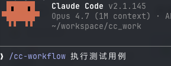

# Claude Code 工作流编排 SKILL

基于 Vue Flow 的 Claude Code 工作流可视化SKILL。
当 Claude Code 开始执行任务时，会自动编排工作流，等待用户确认后，在页面上实时显示每个步骤的执行进度。


## Claude code 集成

### 从源码安装SKILL

```sh
git clone https://github.com/Sunleader1997/cc-workflow.git
cd cc-workflow
sh claude-skills/cc-workflow/install_skill.sh
```

### 更新

```sh
cd cc-workflow
git pull
sh claude-skills/cc-workflow/install_skill.sh
```

### 在 Claude code 中使用



### 访问可视化
https://sunleader.top:9888

## 自建服务端 - Linux-x86

### 从源码构建 

```sh
git clone https://github.com/Sunleader1997/cc-workflow.git
cd cc-workflow
# 打包构建
sh pakcage.sh
# 使用 docker 构建
# sh package.sh --docker
```

### 安装为服务

```sh
sh install.sh
systemctl status cc-workflow
```

```sh
root@asus:~# systemctl status cc-workflow.service 
● cc-workflow.service - Claude Code Workflow Orchestrator
     Loaded: loaded (/etc/systemd/system/cc-workflow.service; enabled; preset: enabled)
     Active: active (running) since Fri 2026-05-22 02:46:47 UTC; 3h 57min ago
   Main PID: 1378140 (cc-workflow)
      Tasks: 2 (limit: 18911)
     Memory: 57.8M (peak: 58.3M)
        CPU: 42.249s
     CGroup: /system.slice/cc-workflow.service
             ├─1378140 /usr/local/bin/cc-workflow
             └─1378142 /usr/local/bin/cc-workflow
```

### 访问页面

```sh
http://${address}:9800
```
